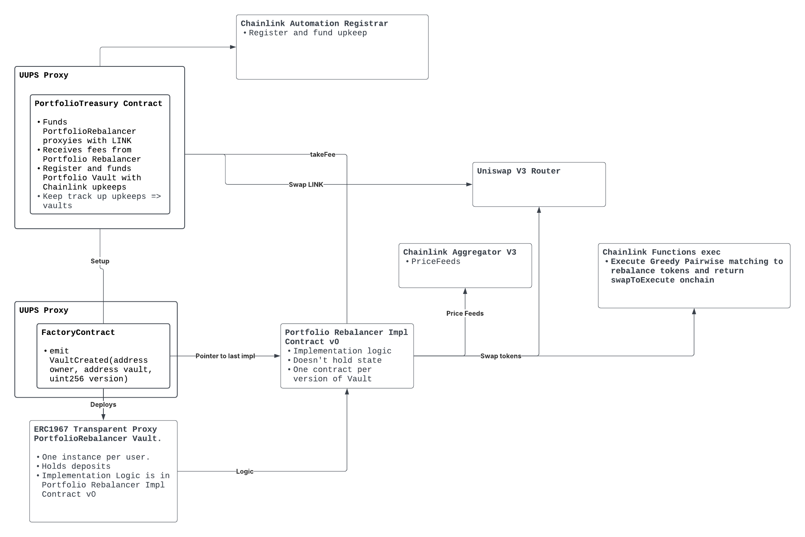

# Portfolio Rebalancer

[](LICENSE)
[](https://docs.soliditylang.org/en/v0.8.19/)

A modular, upgradeable smart contract system for creating per-user portfolio rebalancing vaults on EVM-compatible blockchains. Each user can deploy their own vault (proxy) with a custom basket of ERC-20 tokens and target allocations, and the vault will automatically or manually rebalance using Uniswap V4 and Chainlink price feeds.

> **⚠️ Disclaimer:** This is a personal project for fun and is currently in progress. The code has not been audited and should not be used in production without proper security review. Use at your own risk.

---

## Features

- **Per-user vaults:** Each user owns and configures their own rebalancing vault via proxy.
- **Customizable baskets:** Users select up to 6 ERC-20 tokens and set target allocations (must sum to 100%).
- **Automated & manual rebalancing:** Uses Chainlink Keepers and Uniswap V4 for swaps.
- **Upgradeable:** Built with OpenZeppelin UUPS proxies for future-proofing.
- **Factory contract:** Easy deployment of user vaults with a single transaction.
- **Security:** All sensitive actions are restricted to the vault owner.

---

## Architecture (WIP)



```
User <-> PortfolioRebalancerFactory <-> ERC1967Proxy (user's vault) <-> PortfolioRebalancer (implementation)
```

- **PortfolioRebalancer:** The core logic contract (upgradeable, no state).
- **ERC1967Proxy:** Per-user proxy vault, holds user state and delegates to implementation.
- **PortfolioRebalancerFactory:** Deploys new proxies for users and initializes them.

---

## Prerequisites

- Node.js (>= 16.x)
- npm or yarn
- [Foundry](https://book.getfoundry.sh/) (for Solidity development)
- [OpenZeppelin Contracts](https://github.com/OpenZeppelin/openzeppelin-contracts) and [OpenZeppelin Upgrades](https://github.com/OpenZeppelin/openzeppelin-contracts-upgradeable)

---

## Installation

```bash
# Clone the repo
$ git clone <your-repo-url>
$ cd portfolio-rebalancer

# Install dependencies for dapp (frontend)
$ cd packages/dapp && npm install

# (Optional) Install Foundry for Solidity development
$ curl -L https://foundry.paradigm.xyz | bash
$ foundryup
```

---

## Contracts

- `PortfolioRebalancer.sol` — Upgradeable vault logic (per-user, via proxy)
- `PortfolioRebalancerFactory.sol` — Deploys new user vaults (proxies)
- `IUniswapV4.sol` — Minimal Uniswap V4 interfaces

---

## Deployment & Usage

### 1. Deploy the Implementation

Deploy `PortfolioRebalancer.sol` (UUPS upgradeable) to your target network.

### 2. Deploy the Factory

Deploy `PortfolioRebalancerFactory.sol`, passing the implementation address to the constructor.

### 3. Create a User Vault (Proxy)

Call `createVault` on the factory contract:

```solidity
function createVault(
    address[] calldata tokens,
    address[] calldata priceFeeds,
    uint256[] calldata allocations,
    uint256 rebalanceThreshold,
    address uniswapV4Factory
) external returns (address proxy);
```

- The proxy is initialized with the user as the owner.
- The user can now deposit, withdraw, and manage their vault.

### 4. Interact with Your Vault

- Use the proxy address returned by the factory to interact with your vault.
- Only the vault owner can call sensitive functions (`deposit`, `withdraw`, `rebalance`, `setBasket`, etc.).

---

## Security Notes

- All sensitive actions are restricted to the vault owner (per-proxy).
- The basket and allocations are per-vault, not global.
- The contract uses Chainlink price feeds and Uniswap V4 for secure, on-chain rebalancing.
- Upgradeability is managed via UUPS; only the owner can authorize upgrades.

---

## License

MIT
